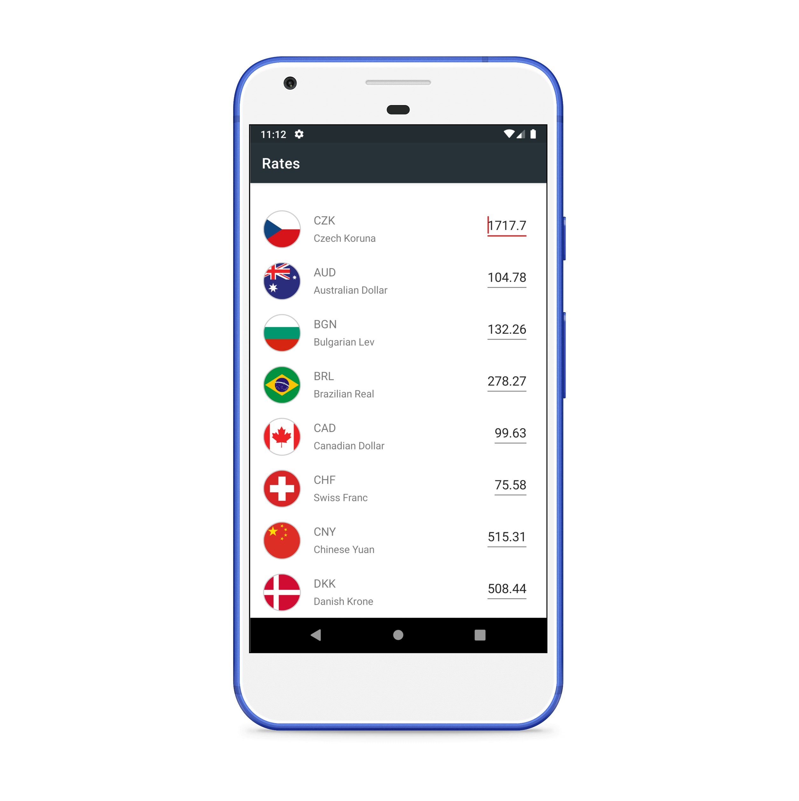
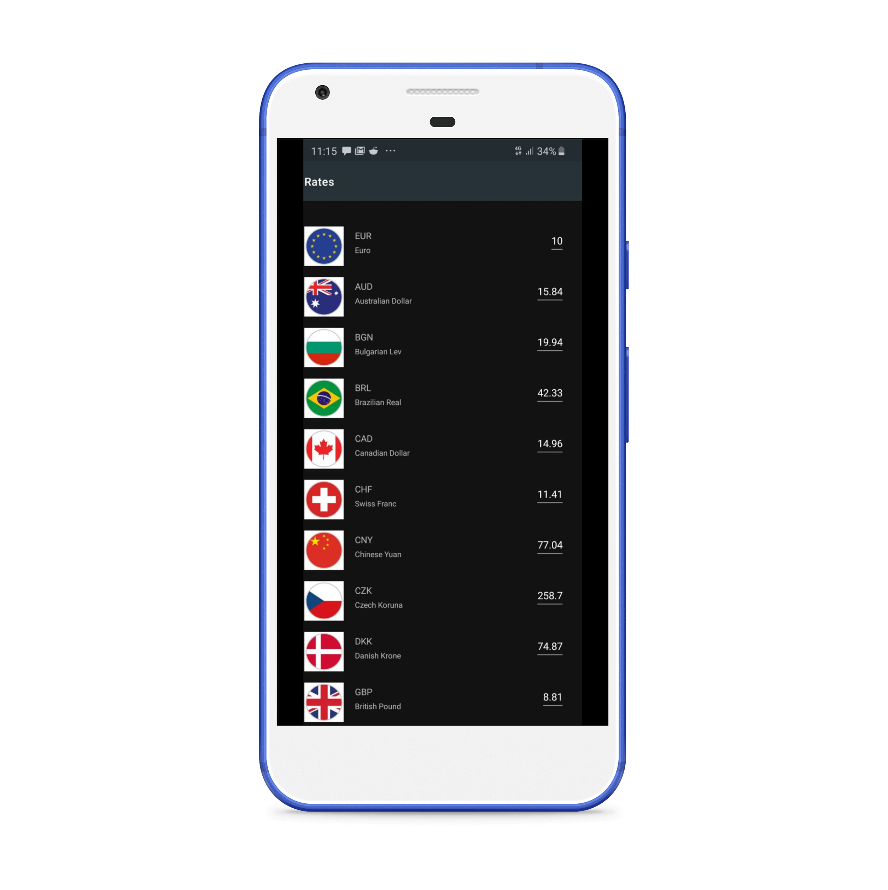

# Real time Currency Conversion  
  
This is an  application helps to see the current value of major currencies around the w:earth_americas:rld and provides realtime exchange data sourced from  public API.  
This application is built with MVVM and the repository pattern and also is a basic RXJava starter project,

  
## What it looks like  
  

  
  

  

  
  
  

  
  
## Libraries  (non -exhaustive list)
  
- [Jetpack](https://developer.android.com/jetpack)  
  - [Viewmodel](https://developer.android.com/topic/libraries/architecture/viewmodel) - Manage UI related data in a lifecycle conscious way   
  and act as the Bridge  between Currency Repository  and Currency Fragment  
  - [Data Binding](https://developer.android.com/topic/libraries/data-binding) - support library that out of the box, enables directing binding of Layout elements to the Currency Data Source  
    
- Networking  
  - [Retrofit](https://square.github.io/retrofit/) - type safe Http client that has RxJava Support  
  - [okhttp-logging-interceptor](https://github.com/square/okhttp/blob/master/okhttp-logging-interceptor/README.md) - logs HTTP request and response data.  
  - [Gson](https://github.com/google/gson) - JSON Parser- Deserialization and Serialization for Objects to Json and vice-versa.  
- Testing  
  - [Mockito](https://site.mockito.org/) - Mocking framework used to provide mocks of my classes in unit tests.  
  - [Truth](https://truth.dev/) - Assertions Library,  
- Dependency Injection  
  - [Dagger2](https://github.com/google/dagger) - Dependency Injection library that promotes modularized and clean code.  
   
- [RxJava 2](https://github.com/ReactiveX/RxJava) - a library for composing asynchronous and event-based programs using observable sequences for the Java VM.
